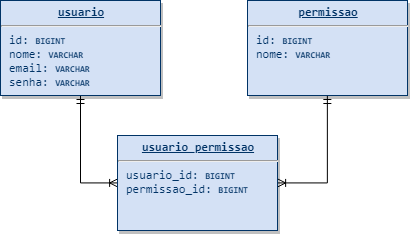

<p align="center">
  <a href="https://github.com/Throyer" target="blank"></a>
</p>

<h1 align="center">Spring Boot API CRUD</h1>
<p align="center">
  Um cadastro de usuarios completo, com permissões de acesso, token JWT testes de integração e unitarios, no padrão API RESTful.
</p>
<br>
<br>

# Motivação

<p>
  A ideia desse repositorio é a criação de uma api em spring boot,
  com o maximo possivel de boas praticas e o mais completa possivel,
  para servir como uma base para min no futuro, ou para outras pessoas
  que estiverem buscando um guia para a construição de uma api com Spring Boot.
  Qualquer pessoa que quiser contribuir ou usar esse projeto é bem vinda.
</p>

# O que foi feito e os proximos passos

- [x] _autenticação com **Spring Security** com **JWT**_.
  - [ ] **refresh token**
- [ ] **CRUD completo de usuarios e permissões**.
  - [x] _usuarios_
  - [ ] **permissões**
- [X] _relatorio de cobertura dos testes_
- [ ] **testes unitarios**
- [ ] **testes de integração**
- [x] _swagger_
- [x] _database migration **Flyway**_
- [x] _Soft delete e TIMESTAMPS_

---

## Requisitos

- MariaDB: `^10.3.11`
- Java: `^11`
> recomendo a instalação do maven localmente, mas o projeto tem uma versão portatil nos arquivos [`mvnw`](./mvnw) e [`mvnw.cmd`](./mvnw.cmd)

Esse projeto foi configurado com [Spring Initializr](https://start.spring.io/).

## Entidades

<p>
  
</p>

> arquivo do [draw.io](./der/spring_boot_crud_der.drawio)

## Instalação

> Caso tiver o maven instalado localmente subistitua `mvnw` por `mvn`


```shell
# Clone o repositório e acesse o diretorio.
$ git clone git@github.com:Throyer/springboot-api-crud.git && cd springboot-api-crud

# Baixe as dependencias (o parametro -DskipTests pula os testes)
$ mvnw install -DskipTests

# Rode a aplicação
$ mvnw spring-boot:run

# Para rodar os testes
$ mvnw test

# Para gerar o relatorio de cobertura apos os testes (fica disponivel em: target/site/jacoco/index.html)
$ mvnw jacoco:report

# Para buildar para produção
$ mvnw clean package
```


## Rodando um teste especifico
use o parametro `-Dtest=<Classe>#<metodo>`


por exemplo o teste de integração de usuario:
```
$ mvnw test -Dtest=UsuariosControllerIntegrationTests#salvar_usuario_sem_campos_obrigatorios_deve_retornar_400
```


## Documentação do Swagger
Assim que a aplicação estiver de pé, fica disponivel em: [localhost:8080/api/v1/swagger-ui](http://localhost:8080/api/v1/swagger-ui.html)

## Postman
Clique [**aqui**](./postman/crud_api.postman_collection.json) para acessar o aquivo `json` da coleção do postman.


<br>
<br>

---

## Variaveis de ambiente

| **Descrição**                         | **parametro**                    | **Valor padrão**          |
| ------------------------------------- | -------------------------------- | ------------------------- |
| contexto da aplicação                 | `contexto`                       | api/v1                    |
| porta da aplicação                    | `port`                           | 8080                      |
| url do banco                          | `db-url`                         | localhost:3306/common_app |
| nome de usuario (banco)               | `db-username`                    | root                      |
| senha do usuario (banco)              | `db-password`                    | root                      |
| mostrar sql na saida                  | `show-sql`                       | false                     |
| tempo de expiração do token em horas  | `token-expiration-time-in-hours` | 24                        |
| valor do secret na geração dos tokens | `token-secret`                   | secret                    |
| maximo de conexões com o banco        | `max-connections`                | 10                        |

> são definidas em: [**application.properties**](./src/main/resources/application.properties)
>
> ```shell
> # para mudar o valor de alguma variavel de ambiente
> # na execução basta passar ela como parametro. (como --port=80 por exemplo).
> $ java -jar api-1.0.0.RELEASE.jar --port=80
> ```
>
> > [Todas opções do `aplication.properties` **padrões** no Spring Boot](https://docs.spring.io/spring-boot/docs/current/reference/html/common-application-properties.html).
> >
> > [Todas **funcionalidades** do Spring Boot](https://docs.spring.io/spring-boot/docs/current/reference/html/spring-boot-features.html).
