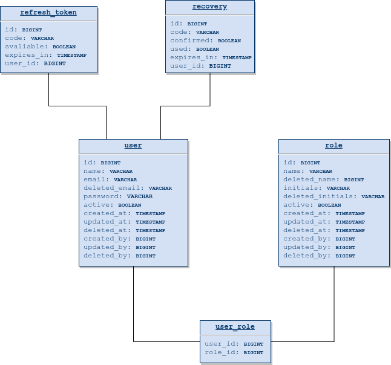

[In Portuguese](https://github.com/Throyer/springboot-api-crud/blob/master/assets/readme.md#spring-boot-api-crud)

<p align="center">
  <a href="https://github.com/Throyer" target="blank"></a>
</p>

<h1 align="center">Spring Boot API CRUD</h1>
<p align="center">
  A complete user registry, with access permissions, JWT token, integration and unit tests, using the RESTful API pattern.
</p>

<br>
<br>

[**Live demo on heroku**](https://throyer-crud-api.herokuapp.com)

<p align="center">
  <a href="https://throyer-crud-api.herokuapp.com" target="blank"></a>
</p>

## Table of Contents

- [Features](#features)
- [Prerequisites](#prerequisites)
- [Entities](#entities)
- [Installation](#installation)
- [Running a specific test](#running-a-specific-test)
- [Swagger](#swagger)
- [Database Migrations](#database-migrations)
- [Environment variables](#environment-variables)

# Features

<p align="center">
  <a href="https://throyer-crud-api.herokuapp.com" target="blank"></a>
</p>


## Prerequisites

- MariaDB: `^10.6.1`
- Java: `^17`
- Maven: `^3.8.4`

This project was started with [Spring Initializr](https://start.spring.io/).

## Entities

<p>
  
</p>

> arquivo do [draw.io](./der/spring_boot_crud_database_diagram.drawio)

## Installation

```shell
# clone the repository and access the directory.
$ git clone git@github.com:Throyer/springboot-api-crud.git && cd springboot-api-crud

# download dependencies
$ mvn install -DskipTests

# run the application
$ mvn spring-boot:run

# run the tests
$ mvn test

# to build for production
$ mvn clean package

# to generate the coverage report after testing (available at: target/site/jacoco/index.html)
$ mvn jacoco:report
```


## Running a specific test
use the parameter `-Dtest=<class>#<method>`


for example the integration test. creating a user:
```
$ mvnw test -Dtest=UsersControllerIntegrationTests#should_save_a_new_user
```


## Swagger
Once the application is up, it is available at: [localhost:8080/documentation](localhost:8080/documentation)


[example on heroku](https://throyer-crud-api.herokuapp.com/documentation)

---

## Database Migrations
Creating database migration files

- Java based migrations
  ```bash
  mvn migration:generate -Dname=my-migration-name
  ```

- SQL based migrations
  ```bash
  mvn migration:generate -Dname=my-migration-name -Dsql
  ```

---

## Environment variables

| **Descrição**                               | **parâmetro**                          | **Valor padrão**          |
| ------------------------------------------- | -------------------------------------- | ------------------------- |
| Server port                                 | `SERVER_PORT`                          | 8080                      |
| database url                                | `DB_URL`                               | localhost:3306/common_app |
| username (database)                         | `DB_USERNAME`                          | root                      |
| user password (database)                    | `DB_PASSWORD`                          | root                      |
| displays the generated sql in the logger    | `DB_SHOW_SQL`                          | false                     |
| set maximum database connections            | `DB_MAX_CONNECTIONS`                   | 5                         |
| secret value in token generation            | `TOKEN_SECRET`                         | secret                    |
| token expiration time in hours              | `TOKEN_EXPIRATION_IN_HOURS`            | 24                        |
| refresh token expiry time in days           | `REFRESH_TOKEN_EXPIRATION_IN_DAYS`     | 7                         |
| SMTP server address                         | `SMTP_HOST`                            | smtp.gmail.com            |
| SMTP server port                            | `SMTP_PORT`                            | 587                       |
| SMTP username                               | `SMTP_USERNAME`                        | user                      |
| SMTP server password                        | `SMTP_PASSWORD`                        | secret                    |

> these variables are defined in: [**application.properties**](./src/main/resources/application.properties)
>
> ```shell
> # to change the value of some environment variable at runtime
> # on execution, just pass it as a parameter. (like --SERVER_PORT=80).
> $ java -jar api-3.0.3.RELEASE.jar --SERVER_PORT=80
> ```
>
> > [All options of `aplication.properties` here](https://docs.spring.io/spring-boot/docs/current/reference/html/common-application-properties.html).
> >
> > [All **features** of Spring Boot](https://docs.spring.io/spring-boot/docs/current/reference/html/spring-boot-features.html).
