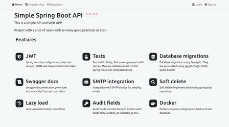

>[🇧🇷 In Portuguese](https://github.com/Throyer/springboot-api-crud/blob/master/assets/readme.md#spring-boot-api-crud)
>
> [🐬 MySQL/MariaDB (outdated) implementation](https://github.com/Throyer/springboot-api-crud/tree/mariadb#readme)

<p align="center">
  <a href="https://github.com/Throyer" target="blank"></a>
</p>

<h1 align="center">Spring Boot API RESTful</h1>
<p align="center">
  A complete user registry, with access permissions, JWT token, integration and unit tests, using the RESTful API pattern.
</p>

<br>
<br>

[**Live demo on heroku**](https://throyer-crud-api.herokuapp.com)

<p align="center">
  <a href="https://throyer-crud-api.herokuapp.com" target="blank"></a>
</p>

## Table of Contents

- [Features](#features)
- [Requirements](#requirements)
- [Entities](#entities)
- [Installation](#installation)
- [Running a specific test](#tests)
- [Swagger](#swagger)
- [Database Migrations](#database-migrations)
- [Docker](#docker-examples)
- [Environment variables](#environment-variables)

# Features

<p align="center">
  <a href="https://throyer-crud-api.herokuapp.com" target="blank"></a>
</p>


## Requirements

- Postgres: `^13`
- Java: `^17`
- Maven: `^3.8.4`

This project was started with [Spring Initializr](https://start.spring.io/#!type=maven-project&language=java&platformVersion=2.6.2&packaging=jar&jvmVersion=17&groupId=com.github.throyer.common&artifactId=api&name=api&description=CRUD%20API&packageName=com.github.throyer.common.api&dependencies=devtools,lombok,web,security,thymeleaf,mysql,h2,data-jpa,flyway,jooq).

## Entities

<p>
  
</p>

>[🚨 draw.io file here](./assets/database/diagram.drawio)

## Installation

```shell
# clone the repository and access the directory.
$ git clone git@github.com:Throyer/springboot-api-crud.git && cd springboot-api-crud

# download dependencies
$ mvn install -DskipTests

# run the application
$ mvn spring-boot:run

# run the tests
$ mvn test

# to build for production
$ mvn clean package

# to generate the coverage report after testing (available at: target/site/jacoco/index.html)
$ mvn jacoco:report
```

## Tests
[](https://coveralls.io/repos/github/Throyer/springboot-api-crud/badge.svg?branch=master)

## Running a specific test
use the parameter `-Dtest=<class>#<method>`


for example the integration test. creating a user:
```
$ mvn test -Dtest=UsersControllerIntegrationTests#should_save_a_new_user
```


## Swagger
Once the application is up, it is available at: [localhost:8080/documentation](localhost:8080/documentation)


[example on heroku](https://throyer-crud-api.herokuapp.com/documentation)

---

## Database Migrations
Creating database migration files

> 🚨 make sure you have maven in your environment
and that you are in the correct directory __./api__


- Java based migrations
  ```bash
  mvn migration:generate -Dname=my-migration-name
  ```

- SQL based migrations
  ```bash
  mvn migration:generate -Dname=my-migration-name -Dsql
  ```

---

## Docker examples

> 🚨 create `environment` file
>
> ```bash
>  cp docker/.env.example docker/.env
> ```

- docker compose development
  ```bash
  docker-compose -p example-api-development -f ./docker/docker-compose.dev.yml --env-file ./docker/.env up -d --force-recreate
  ```

- docker compose production
  ```bash
  docker-compose -p example-api -f ./docker/docker-compose.prod.yml --env-file ./docker/.env up -d --build
  ```

or

- development up / down
```
scripts/dev.sh up
```

```
scripts/dev.sh down
```

- production up / down
```
scripts/prod.sh up
```

```
scripts/prod.sh down
```

## Environment variables

| **Description**                          | **Parameter**                      | **Default values**        |
|------------------------------------------|------------------------------------|---------------------------|
| server port                              | `SERVER_PORT`                      | 8080                      |
| database url                             | `DB_URL`                           | localhost:5432/common_app |
| username (database)                      | `DB_USERNAME`                      | root                      |
| user password (database)                 | `DB_PASSWORD`                      | root                      |
| displays the generated sql in the logger | `DB_SHOW_SQL`                      | false                     |
| set maximum database connections         | `DB_MAX_CONNECTIONS`               | 5                         |
| secret value in token generation         | `TOKEN_SECRET`                     | secret                    |
| token expiration time in hours           | `TOKEN_EXPIRATION_IN_HOURS`        | 24                        |
| refresh token expiry time in days        | `REFRESH_TOKEN_EXPIRATION_IN_DAYS` | 7                         |
| SMTP server address                      | `SMTP_HOST`                        | smtp.gmail.com            |
| SMTP server port                         | `SMTP_PORT`                        | 587                       |
| SMTP username                            | `SMTP_USERNAME`                    | user                      |
| SMTP server password                     | `SMTP_PASSWORD`                    | secret                    |
| time for recovery email to expire        | `MINUTES_TO_EXPIRE_RECOVERY_CODE`  | 20                        |
| max requests per minute                  | `MAX_REQUESTS_PER_MINUTE`          | 10                        |
| swagger username                         | `SWAGGER_USERNAME`                 | `null`                    |
| swagger password                         | `SWAGGER_PASSWORD`                 | `null`                    |

> these variables are defined in: [**application.properties**](./src/main/resources/application.properties)
>
> ```shell
> # to change the value of some environment variable at runtime
> # on execution, just pass it as a parameter. (like --SERVER_PORT=80).
> $ java -jar api-4.1.2.jar --SERVER_PORT=80
> ```


> [All options of `aplication.properties` here](https://docs.spring.io/spring-boot/docs/current/reference/html/common-application-properties.html).
>
> [All **features** of Spring Boot](https://docs.spring.io/spring-boot/docs/current/reference/html/spring-boot-features.html).
